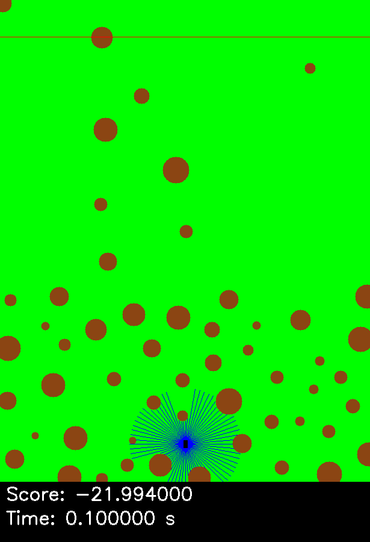

# Drone forest

Toy environment for UAV flying through the random forest.
This repository containes two different approaches to autonomously control a drone:

1. Tangled Program Graphs (TPGs) with [Gegelati](https://github.com/gegelati/gegelati).
2. Reinforcement Learning (RL) algorithms with [stable-baselines3](https://github.com/DLR-RM/stable-baselines3).

## Repository overview

The core functionality of this repository - simulation of toy forest environment with a UAV flying through it - is implemented as a C++ library (using C++17).
Therefore it is organised as a CMake project with `.h` headers in [include](include) and `.cc` sources in [src](src) directory.
Unit tests are prepared with [googletest](https://github.com/google/googletest) library and stored in [tests](tests) directory.

To integrate the simulator with Python-based RL framework, the [pybind11](https://github.com/pybind/pybind11) library is used, with sources included as a submodule in [extern](extern) directory.
All necessary Python scripts are located in [scripts](scripts) directory, which includes also source file for the binding.

## Simulator overview



Simulator consists of the forest and the UAV equipped with LiDAR sensor.
The goal is to fly forward a certain distance without colliding with a single tree based on the LiDAR measurements.

Both forest and drone have some configuration parameters stored in the [env_config.json](env_config.json) file.

## How to use TPG

For the TPG part you need to install the Gegelati library, according to the [instruction](https://github.com/gegelati/gegelati?tab=readme-ov-file#hammer_and_wrench-build-and-install-the-library).

To setup the TPG agent, the [params.json](params.json) configuration file is needed.

### Training

To start TPG training process you need to build and run `run_gegelati` CMake target.

During training, the program will iteratively show an evaluation of current UAV performance by displaying the rendered environment window.
You can control the execution of the program by pressing the following keys on active display window (internally it uses the OpenCV's waitKey() method to read inputs):

- `q` - quit program,
- `h` - hide evaluation (a.k.a. do not perform it) - it should significantly reduce the execution time,
- `s` - show evaluation.

Output data are stored in `logs_tpg` directory, with separate experiment directories, which names are based on the training start time.

### Evaluation

To evaluate the trained TPG you need to build and run `eval_gegelati` CMake target.
This program takes two arguments:

1. [Mandatory] Seed for the environment initialisation to ensure evaluation reproducability.
2. [Optionally] Path to the directory where program will save the simulation window (as `PNG` file) rendered at each timestamp. If no path is provided, program will not save images.

At the beginning program will ask which experiment you would like to evaluate based on experiment directories inside `logs_tpg`.
You need to provide a valid number.

## How to use RL

**NOTE:** To use RL you need to ensure that the Python binding is already built (just build all with CMake) - [drone_forest_py.cc](scripts/src/drone_forest_py.cc) is the source file for this.

For the RL part, you need to install the stable-baselines3 library with the following command:

```
pip install stable-baselines3[extra]
```

More info about it [here](https://stable-baselines3.readthedocs.io/en/master/guide/install.html).

### Training

To start the training process you need to run the [run_rl.py](run_rl.py) script.
Program will read the environment configuration from [env_config](env_config.json), create simulator and start the training with [PPO](https://stable-baselines3.readthedocs.io/en/master/modules/ppo.html) algorithm.
During training, program will periodically perform evaluation and display results on the screen.

Output data are stored in `logs_ppo` directory, with separate experiment directories, which names are based on the training start time.
This directories includes also tensorboard files, which can be displayed during training to track the progress.

### Evaluation

To evaluate the trained RL agent you need to run the [eval_rl.py](eval_rl.py) script, which takes two arguments:

1. [Mandatory] Path to the experiment directory.
2. [Optionally] Number of evaluation iterations.
